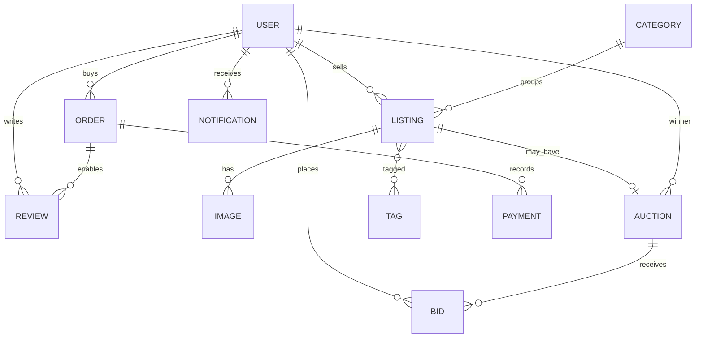
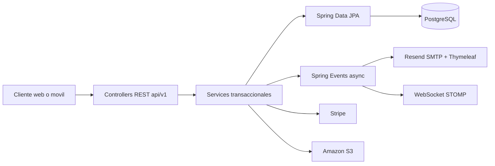

# Yala Backend - Marketplace de subastas de coleccionables

**Curso:** CS 2031 Desarrollo Basado en Plataforma  
**Equipo:** Kate Alva Torres, Micaela Garro, Hector Choque, Israel Carlos y Royer Ramos  
**Stack principal:** Java 17, Spring Boot 3.3.6, PostgreSQL, Spring Security JWT, Docker, Stripe, Amazon S3, Resend y Testcontainers.

## Indice

1. Introduccion
2. Problema y necesidad
3. Solucion implementada
4. Modelo de entidades
5. Arquitectura y decisiones tecnicas
6. Seguridad
7. Eventos y asincronia
8. Testing y manejo de errores
9. Ejecucion local y Docker
10. Deployment AWS
11. GitHub, CI/CD y gestion
12. Conclusiones, licencia y referencias

## Introduccion

Yala es el backend de un marketplace especializado en coleccionables para Latinoamerica. El proyecto permite registrar compradores, vendedores y administradores; publicar cartas Pokemon TCG, Funko Pops, comics y otros items; crear subastas con pujas en tiempo real; procesar ordenes y pagos; almacenar imagenes; enviar correos HTML; y mantener notificaciones dentro de la aplicacion. El objetivo del backend es ofrecer una base robusta y extensible para una experiencia web o movil en la que la confianza sea tan importante como la compra.

El sistema fue desarrollado como entrega final del componente backend del curso CS 2031. Por eso prioriza arquitectura por capas, DTOs, validaciones, seguridad stateless, manejo global de excepciones, pruebas BDD e integraciones externas listas para ambientes reales.

## Problema y necesidad

Los coleccionistas de cartas, figuras y comics suelen comprar y vender en canales generalistas como redes sociales o marketplaces no especializados. Esto genera problemas de confianza: poca estandarizacion de condiciones, baja trazabilidad de pagos, reputaciones dispersas, vendedores no verificados y subastas sin reglas claras. Yala responde a esa necesidad con un backend que centraliza identidad, reputacion, publicaciones, subastas, pujas, pagos y notificaciones bajo reglas de negocio consistentes.

La solucion es relevante porque el valor de un coleccionable depende de detalles como condicion, rareza, historial de pujas y confiabilidad del vendedor. El backend protege esos flujos con validaciones de DNI, roles, restricciones de vendedor, bloqueo optimista para pujas concurrentes y registros persistentes de pagos y ordenes.

## Solucion implementada

El backend implementa registro y login con JWT, refresh tokens, perfiles publicos, verificacion de identidad, registro de tiendas, aprobacion de vendedores por administradores, categorias, publicaciones con filtros avanzados, subastas programadas o inmediatas, pujas, ordenes, Stripe PaymentIntent, webhook publico de Stripe, reviews mutuas, notificaciones, WebSockets STOMP, subida de imagenes a Amazon S3 y correos HTML via JavaMailSender usando Resend SMTP.

Las funcionalidades principales son:

- Usuarios con roles `USER`, `SELLER` y `ADMIN`.
- Publicaciones de precio fijo o modo subasta, con maximo de 20 publicaciones activas por vendedor.
- Subastas con duracion de 1, 3, 5 o 7 dias y scheduler cada 60 segundos.
- Pujas validadas: monto mayor al precio actual, usuario con DNI verificado, no vendedor propio y sin pujas consecutivas del mismo usuario.
- Ordenes con comision del 8%, deadline de pago de 48 horas y flujo `PENDING -> CONFIRMED -> IN_TRANSIT -> COMPLETED`.
- Expiracion automatica de pagos y oferta al segundo mejor postor.
- Reviews solo cuando la orden esta completada.
- Notificaciones y correos asincronos para eventos relevantes.

## Modelo de entidades

El modelo contiene 11 entidades JPA: `User`, `Category`, `Listing`, `Image`, `Tag`, `Auction`, `Bid`, `Order`, `Payment`, `Review` y `Notification`. Todas usan relaciones JPA con `FetchType.LAZY` donde corresponde, enums persistidos como `STRING`, validaciones con Bean Validation y DTOs para no exponer entidades directamente.



## Arquitectura y decisiones tecnicas

El proyecto sigue arquitectura por dominio dentro del paquete raiz `com.yala`. Cada dominio contiene `controller`, `service`, `repository`, `model` y `dto` cuando aplica. Los controllers son delgados y delegan en servicios; los servicios contienen la logica de negocio y transacciones; los repositorios encapsulan queries JPQL y acceso a datos. La inyeccion de dependencias se realiza por constructor con Lombok `@RequiredArgsConstructor`.



Las decisiones principales fueron usar Java records para DTOs inmutables, `@Version` en `Auction` para proteger pujas concurrentes, `Pageable` en endpoints de listado, SpringDoc OpenAPI para Swagger, Testcontainers para verificar comportamiento real en PostgreSQL y Docker Compose para reproducibilidad local.

## Seguridad

La seguridad usa Spring Security en modo stateless. El endpoint de login emite access token de 24 horas y refresh token de 7 dias. El `JwtAuthFilter` lee el header `Authorization: Bearer`, valida firma, expiracion y claims, y carga el `SecurityContext`. Las rutas publicas incluyen auth, listados publicos, subastas, categorias, reviews publicas, perfiles publicos, Swagger y webhook de Stripe. El resto requiere autenticacion y los endpoints sensibles usan `@PreAuthorize`.

No se exponen `passwordHash`, DNI completo ni CCI en DTOs de respuesta. Las credenciales viven en variables de entorno o `.env`, que esta ignorado por Git. La clave `JWT_SECRET` debe tener minimo 32 caracteres y `CCI_ENCRYPTION_KEY` cifra el CCI de tiendas antes de guardarlo. CORS y CSRF estan configurados para API stateless; las validaciones de permisos reales se aplican tambien en servicios para no confiar en parametros manipulables.

## Eventos y asincronia

El backend usa eventos Spring para desacoplar acciones secundarias: bienvenida de usuario, nueva puja, subasta finalizada, subasta sin pujas, orden confirmada, pago expirado, tienda aprobada y vendedor verificado. Los listeners son asincronos y algunos usan `@TransactionalEventListener(AFTER_COMMIT)` para ejecutar notificaciones solo despues de confirmar cambios en base de datos. Esto evita que emails o WebSockets bloqueen la transaccion principal y mejora la resiliencia ante servicios externos.

## Testing y manejo de errores

La suite contiene pruebas BDD con JUnit 5, Mockito, `@WebMvcTest`, `@DataJpaTest` y Testcontainers. Actualmente ejecuta 52 tests con 0 fallos. Los tests de repositorio corren contra PostgreSQL real en Docker; los de servicio mockean dependencias; y los de controller verifican status HTTP, cuerpos JSON y excepciones.

El manejo de errores esta centralizado en `GlobalExceptionHandler`, con respuestas uniformes `timestamp`, `status`, `error`, `message` y `path`. Existen excepciones custom para recursos no encontrados, duplicados, operaciones invalidas, identidad no verificada, limites de publicaciones, imagenes, reviews, pagos, autorizacion y errores de puja. Tambien se manejan errores de validacion, JSON malformado, acceso denegado y bloqueo optimista.

## Ejecucion local y Docker

Requisitos: Java 17+, Docker Desktop y Maven Wrapper incluido.

```bash
cp .env.example .env
# editar .env con valores reales o placeholders de sandbox
docker compose up postgres -d
./mvnw spring-boot:run
```

En local, PostgreSQL queda publicado en el host por `localhost:5433` y la API por `localhost:8081`.

Si se ejecuta desde IntelliJ IDEA, la configuracion Spring Boot debe usar la clase principal `com.yala.YalaApplication`. El campo `Environment variables` no carga archivos `.env` por ruta; espera pares `VAR=valor` separados por punto y coma. Para usar archivo, instala/activa soporte de env file y apunta a `.env`, no a `.env.example`. El archivo `.env.example` es solo plantilla versionable; `.env` es la copia local con valores reales o placeholders de sandbox.

Swagger queda disponible en:

```text
http://localhost:8081/swagger-ui.html
```

Para levantar API y base de datos con Docker Compose:

```bash
docker compose up --build
```

Usuarios seed documentados en `data.sql`: `buyer@yala.pe`, `seller@yala.pe` y `admin@yala.pe`, todos con password `Test1234`.

## Deployment AWS

La rubrica otorga el puntaje completo de deployment cuando el backend esta publicado en AWS usando ECS o EC2 mas RDS PostgreSQL, con variables de entorno de produccion, security groups configurados y URL publica funcional. Este repositorio incluye `Dockerfile`, `.env.example` y la guia [docs/AWS_DEPLOYMENT.md](docs/AWS_DEPLOYMENT.md). Para produccion se debe crear RDS PostgreSQL, un bucket S3 para imagenes, construir y subir la imagen a ECR, crear el servicio ECS Fargate o una instancia EC2, configurar secrets y exponer el API mediante un Application Load Balancer o IP publica. Link local: `http://localhost:8081/swagger-ui.html`. Link AWS: pendiente de provisionar con credenciales reales.

## GitHub, CI/CD y gestion

El workflow `.github/workflows/ci.yml` ejecuta `mvn clean verify` en push a `main` o `develop` y en pull requests a `main`, usando PostgreSQL como servicio. El flujo recomendado es GitFlow: ramas `feature/*`, integracion en `develop` y promocion a `main` con pull request. Los commits deben seguir Conventional Commits, por ejemplo `feat(auction): add bid validation` o `test(listing): add repository filters`.

## Conclusiones, licencia y referencias

Yala logra un backend completo para un marketplace de coleccionables con reglas de negocio no triviales: subastas, identidad, reputacion, pagos, emails, WebSockets, storage y automatizaciones. El aprendizaje principal fue integrar capas limpias con eventos asincronos y pruebas realistas sobre PostgreSQL. Como trabajo futuro quedan el frontend, observabilidad avanzada, despliegue AWS real con dominio HTTPS, panel administrativo completo y endurecimiento de cifrado para CCI.

Licencia sugerida: MIT para fines academicos. Referencias: rubrica del Proyecto 1 DBP 2026-1, documento de logica de negocio "Marketplace de subastas de coleccionables" y documentacion oficial de Spring Boot, Stripe, Amazon S3, Docker y AWS.
